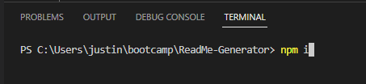
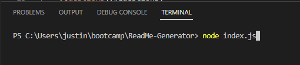
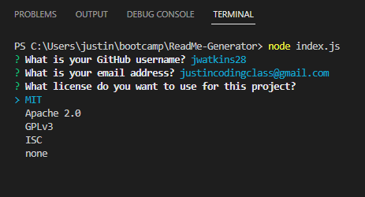
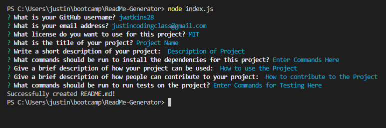
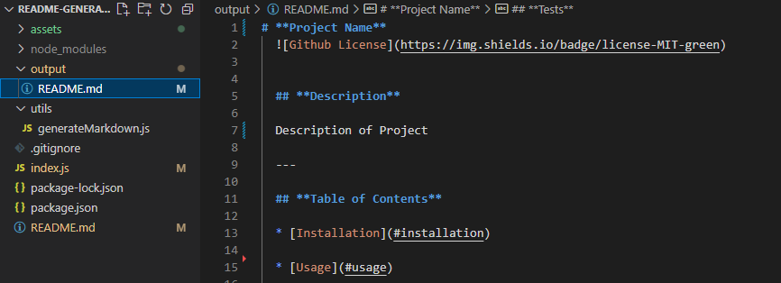
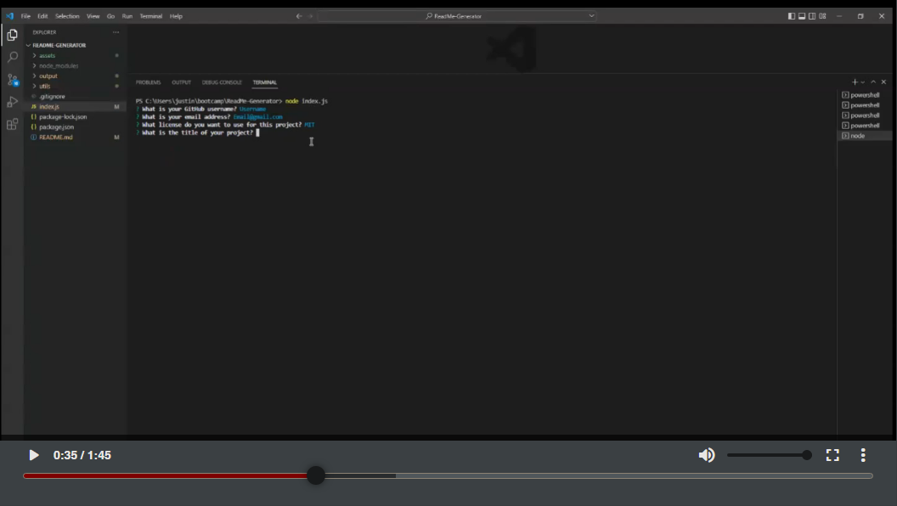

# **ReadMe Generator**


## **Description**

This project was the first challenge using NodeJS and NPM dependencies. It's a simple program designed to generate a ReadMe file in order to speed up development time by not having to create one from scratch for every project. In fact the base of this ReadMe was generated using this generator! 

Since this application uses the terminal and is not deployed, reference the "screenshots" or "video tutorial" section for instructions on how to use this. 

GitHub Repo: [https://github.com/JWatkins28/ReadMe-Generator](https://github.com/JWatkins28/ReadMe-Generator)

Video of program in use: [https://drive.google.com/file/d/1cpYWgFdUt3BhgN_8-TayVFXD8VZmGch7/view](https://drive.google.com/file/d/1cpYWgFdUt3BhgN_8-TayVFXD8VZmGch7/view)

---
  
## **Table of Contents**
  
* [Installation](#installation)
  
* [Screenshots](#screenshots)

* [Video Tutorial](#video)

* [Usage](#usage)
 
* [License](#license)
  
* [Contributing](#contributing)
  
* [Tests](#tests)
 
* [Questions](#questions)
  
---
  
## **Installation**
  
To install the needed dependencies, run the following commands:
  
```
npm i 
```
 
---
  
## **Screenshots & Video**

First Install the Dependencies
\

\
\
Then start the program and follow the prompts
\

\
\
Follow the prompts and choose your license using the arrows keys
\

\
\
Once finished you should see a message stating the ReadMe was created
\

\
\
View your newly generated ReadMe in the output folder
\

\

---

## **Video Tutorial**
A video on how to install and run this program can be viewed by clicking the screenshot below: 
[](https://drive.google.com/file/d/1cpYWgFdUt3BhgN_8-TayVFXD8VZmGch7/view)

Or clicking this link: [https://drive.google.com/file/d/1cpYWgFdUt3BhgN_8-TayVFXD8VZmGch7/view](https://drive.google.com/file/d/1cpYWgFdUt3BhgN_8-TayVFXD8VZmGch7/view)

---

## **Usage**

This project is free to be used as you want. You can create your own ReadMe files much quicker than creating from scratch by utilizing this program. 

---
  
## **License**
  
This project is licensed under the MIT license.
  
---
  
## **Contributing**
  
This is open-source so feel free to make contributions to the repo or fork it for your own use. 
  
---
  
## **Tests**
  
To test the project, run the following commands:
  
```
node index.js
```
  
---
  
## **Questions**
  
If you have any questions about the project or repo, contact me directly at justincodingclass@gmail.com or open an issue on the repo. You can find my github profile with this project and others at [github.com/jwatkins28](https://github.com/jwatkins28/)
